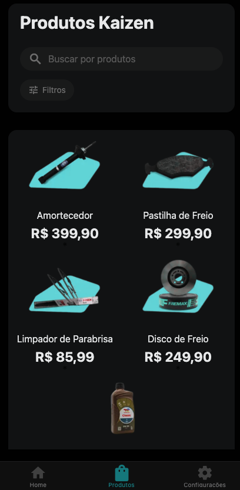

# Kaizen App

Um aplicativo exemplo desenvolvido para a **Kaizen Autopeças**, com objetivo de demonstrar como seria um aplicativo da empresa.  
O app apresenta uma interface simples e funcional, exibindo produtos, atalhos úteis e uma pequena navegação entre telas.

---

## 🚀 Tecnologias utilizadas

- **React Native**
- **Expo**
- **Expo Router**
- **TypeScript**

---

## 📱 Funcionalidades

- **Home Page**  
  Exibe uma visão geral do app e navegação principal.

- **Página de Produtos**  
  Lista produtos básicos da Kaizen Autopeças para fins demonstrativos.

- **Página de Configurações**  
  Contém cards que redirecionam para:
  - Site oficial
  - WhatsApp da empresa

---

## 🖥️ Pré-requisitos

Antes de rodar o app, você precisa ter instalado:

- **Node.js**
- **Expo CLI**
- **Yarn** ou **npm**

Para instalar o Expo CLI:

```bash
npm install -g expo-cli
```

## Interface




